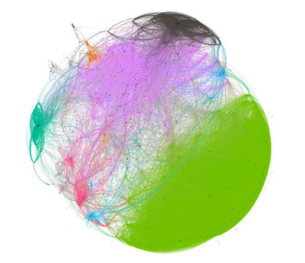

# 1.依赖环境
1.安装Python3、Google Chrome、MongoDB、Gephi

2.安装Python依赖

    pip install -r requirements.txt

------

# 2.数据抓取

## 2.1准备工作

​	微博具有一定的反爬机制：

- 单一IP频繁请求会被提示**414**错误。

- 不使用Cookies会被重定向至微博首页，爬虫无法获取内容。

  针对第一点，本爬虫会使用IP代理池（后续会说明）。首先获取用于绕过微博登录的Cookies。

### 2.1.1获取Cookies

​	获取Cookies依赖于**chromedriver**和**selenium**。

​	运行**getcookies.py**，按提示完成登录操作后，得到cookies.json。

​	**注：建议注册一个微博小号。因为在后面的数据抓取过程中，账号可能会被短暂限制。虽然本项目实施过程中没有被永封账号，不过以防万一。**

### 2.1.2获取微博视频的链接池

​	要抓取微博视频的数据，首先要确定抓哪些视频。本项目中，视频链接的获取来源为微博视频的首页地址（https://weibo.com/tv）。在微博视频的首页中，包含十二个分类的视频。每个视频分类下具有300个左右的视频，这些分类下的视频通常会定期更新。

​	运行**getlinks.py**,即可抓取微博视频首页下的约3600个视频链接。

​	每隔几天进行一次抓取并去除重复链接。最终，本项目一共获取19899条微博视频的链接。

------

## 2.2抓取微博视频的信息

​	本部分为抓取的主要过程，耗时较长。为缩短抓取时间，爬虫引入多线程。但是，单一IP频繁请求微博视频，会被新浪提示**414**错误，故本爬虫支持IP代理池的使用。把可使用的**https代理或socks5代理**填入value文件夹下的proxies_useable.json即可。

​	运行**getpageinfo.py**，开始抓取微博视频的信息。抓取的主要信息有：

- 视频的评论数、转发数、点赞数、作者名称、视频的16位id、视频标题。

- 视频的评论内容，每个视频的评论内容通常含有一级评论和二级评论两部分。一级评论为对视频的直接评论，二级评论为对一级评论的评论。

- 视频的转发信息。转发信息主要包含两部分：一是转发过视频的用户id，即谁转发过视频；二是每个用户转发视频的具体时间，精确到每一天的日期。

  在获取的19899条微博视频的链接中，有一部分的视频已经被删除或失效。排除失效视频后，本项目最终一共      

获取16366条视频的数据。

​	**注1：如不填入代理，则默认只使用本地IP。**

​	**注2：假设你有N个可用于抓取的IP，建议最大线程数不超过2N。否则容易被提示414错误。**

​	**注3：本项目租用了京东云的服务器架设代理，因为京东云支持按小时计费。**

------

# 3.数据处理

## 3.1数据去重

​	原理上，使用本项目的代码抓取微博视频数据后，不会有重复的视频数据。因为代码会自动剔除已经抓取过的链接。但是在抓取过程中，可能会有多次被中断的情况，已抓取的链接未能及时被剔除。故对抓取的数据进行去重是必要的。

------

## 3.2初步统计

​	16366条微博视频的原始数据文件大小为252MB。在16366个视频中，评论数大于（含）50的视频数为2794。与视频有交互行为的用户有1093434位，用户转发2081529次，用户评论1184122条，用户点赞4494776次。

| **项目**   | **数量** |
| ---------- | -------- |
| **视频数** | 16366    |
| **转发数** | 2081529  |
| **评论数** | 1184122  |
| **点赞数** | 4494776  |
| **用户数** | 1093434  |

 	**注：数据去重和初步统计的代码Github上不提供。**

------

## 3.3分词处理

### 3.3.1移除评论数小于50的视频

​	如果用户评论数过少，而且会影响后续关键词的提取，使得到的关键词不具有代表性，并不一定能够真实正确的反映视频的内容。故将用户评论数较小的视频移除。选择50条评论作为指标，使得剩余的视频数不至于过少。

​	移除用户评论数小于50条的视频之后，用于后续处理的视频共有2794个。平均每个视频被评论的次数是72.35。

### 3.3.2中文评论分词&关键词提取

​	使用结巴分词的精确模式对微博视频下的用户评论进行分词。在精确模式下，结巴分词基于最大概率路径, 找出基于词频的最大切分组合，将句子最精确的切分开。

​	结巴分词系统中实现了两种关键词抽取算法，一为TF-IDF算法二为TextRank算法。项目选用TextRank算法提取关键词。对每个视频提取不超过20个关键词，方便下一步计算视频间的相似度。

​	**注：分词处理的代码在extract_tags.py中。**

------

## 3.4视频相似度计算与聚类

### 3.4.1视频相似度计算

​	相似度计算采用余弦相似度。对任意两个视频 A、 B，计算他们之间的相似度方法如下： 

1. 取出 A、B 的关键词集合 tags_a、tags_b，其中 tags_a 包含 a 个关键词，tags_b 包含 b 个关键词；

2. 将 tags_a 中的 a 个关键词与 tags_b 中的 b 个关键词合并，构成新的关键词集合 tags； 

3. 分别统计 tags 中的关键词在 A、B 的用户评论中的相对词频； 

4. 根据 A、B 相对词频构造特征向量 α、β， α = (𝛼1, 𝛼2, ··· , 𝛼𝑛) β = (𝛽1, 𝛽2, ··· ,𝛽𝑛) 

5. 计算特征向量 α 和 β 的夹角余弦值，得到 A、B 的相似度。

   运行**similar.py**，对每一个视频进行计算，计算其他视频和该视频之间的相似度。

### 3.4.2聚类

​	用Gephi软件及内置的Fast Unfolding算法来对这些视频进行聚类，选取相似度阈值为0.5。聚类结果如下。

------

# 4.视频推荐测试与效果评价

​	视频推荐采用的是基于用户行为的协同过滤算法，即基于用户感兴趣的视频，推荐其相同类型或近似类型的视频。对于用户感兴趣的定义，因为无法获取视频的具体观看记录，而研究表明，80%的用户对其转发的视频感兴趣，因此，若该用户转发了该视频，即认为该用户对该视频有兴趣。

​	按照下列步骤对推荐算法进行测试：

1. 从测试用户转发过的视频中，随机抽取一个视频。

2.  根据视频相似度聚类的结果，找到该段视频所属的分组。

3. 对该分类下的视频进行按照相似度的排序。

4. 选择不超过20个相似度较高的视频，作为向用户推荐的视频。

5. 验证推荐的算视频是否存在于用户转发过的视频中。  

   在测试过程中，每次测试随机抽取30个用户进行推荐测试，总共进行了417次测试，将推荐算法与热门推荐、

随机推荐进行对比，结果如下表。

|              | **准确率****P** | **召回率****R** | **F1-Measure** |
| ------------ | --------------- | --------------- | -------------- |
| **推荐算法** | 0.039444        | 0.038102        | 0.03703        |
| **热门推荐** | 0.01996         | 0.030704        | 0.024912       |
| **随机推荐** | 0.004508        | 0.006885        | 0.005147       |

​	**注：详细测试结果见result.txt。**